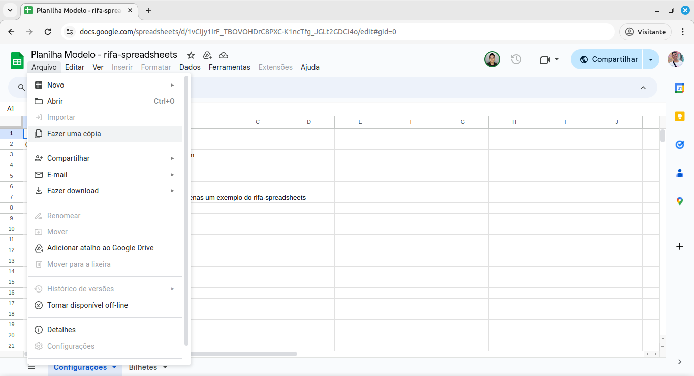
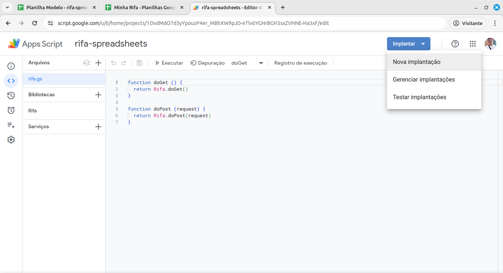

# rifa-spreadsheets

Faça rifas online com pagamento por Pix utilizando o Google Spreadsheets.

Exemplo [rifa.dgls.me](https://rifa.dgls.me/)


## Criando a planilha

1. Faça uma cópia da [Planilha Modelo](https://docs.google.com/spreadsheets/d/1vCIjy1IrF_TBOVOHDrC8PXC-K1ncTfg_JGLt2GDCi4o/edit?usp=sharing) para a sua conta Google.
   
   Atenção: O **Arquivo do Apps Script anexado** deve ser copiado junto...
   
1. Configure sua rifa de acordo com a suas necessidades na planilha da rifa.
   

## Crie a página da rifa

Para fazer o **build** da página da sua rifa você precisa da URL do

1. Vá até **Extensões > Apps Script**
   
1. Implemente um App da Web
   
   Mantenha marcado apenas **App da web**.
   
   Atenção: Em **Quem pode acessar** selecione **Qualquer pessoa**.
   
   Clique em **Implementar** e autorize a aplicação.
   Possivelmente o Google irá te pedir para verificar essa aplicação **unsafe**, basta clicar em **Advanced** e em seguida **Go to rifa-spreadsheets (unsafe)**.
   
1. Copie a **URL** do **App na Web**
   
1. Faça o build da app passando a variável de ambiente `SCRIPT_GOOGLE_URL` com a **URL** do **App na Web**
   ```sh
   $ export SCRIPT_GOOGLE_URL='[URL do App na Web]'
   $ npm run build
   ```
1. Faça o deploy na sua CDN de preferência com os arquivos de output em `dist/`.

